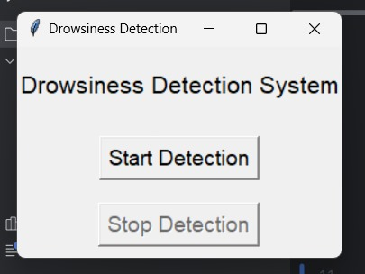
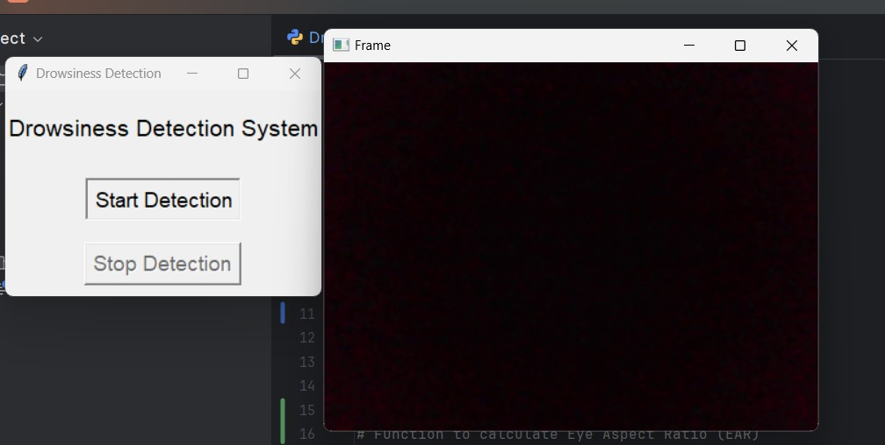

# Drowsiness Detection System

This project implements a **Drowsiness Detection System** that uses computer vision and machine learning to monitor a user's eyes for signs of drowsiness. The system works in real-time using the webcam to detect when a person is blinking excessively or showing signs of drowsiness, triggering an alert sound. 

This application is built using **Python**, **OpenCV**, **Dlib**, and **Tkinter** for the graphical user interface (GUI).

---

## Features

- **Real-Time Drowsiness Detection**: Monitors the eyes using webcam input and calculates the Eye Aspect Ratio (EAR) to detect drowsiness.
- **Alert System**: When drowsiness is detected, the system displays an alert message and plays an audio warning.
- **Start and Stop Detection**: Users can start and stop the detection process via the GUI.
- **User-Friendly Interface**: A simple Tkinter-based interface to easily interact with the application.

---


## Installation


Follow the steps below to set up and run the Drowsiness Detection System on your local machine.

### Prerequisites

1. **Python 3.x** (Install from [python.org](https://www.python.org/downloads/))
2. **Tkinter** (Usually comes with Python by default)
3. **OpenCV**: For image processing and face detection.
4. **Dlib**: For facial landmark detection.
5. **Imutils**: For simplifying image processing tasks.
6. **Pygame**: For playing the alert sound when drowsiness is detected.
7. **SciPy**: For calculating the Eye Aspect Ratio (EAR).

To install the required libraries, run:

```bash
pip install opencv-python dlib imutils pygame scipy
```

## Appendix

## Usage
Start Detection:
Launch the application by running main.py.
Click Start Detection to begin monitoring for drowsiness.
The system will use your webcam to detect facial landmarks and analyze your eye aspect ratio.
Stop Detection:
Click Stop Detection to stop the monitoring process.
Alert:
If drowsiness is detected (EAR is below a certain threshold), an alert will be triggered with a warning message displayed on the screen, and an audio sound will be played.
Code Overview
## Key Files:
main.py: The main Python script that runs the Drowsiness Detection System and the Tkinter GUI.
models/shape_predictor_68_face_landmarks.dat: The Dlib facial landmark predictor model.
music.wav: The alert sound that will play when drowsiness is detected.
## Functionality:
Eye Aspect Ratio (EAR): The EAR is calculated using the distances between key eye landmarks, and a threshold is used to determine if the user is drowsy.
Tkinter GUI: A simple interface that provides buttons to start and stop detection. It also provides visual alerts when the user is drowsy.
Example:
Start Detection:
The webcam starts, and the system begins monitoring the user's eye aspect ratio.
Drowsiness Detected:
If the EAR falls below the threshold, an alert will appear on the screen, and the audio file (music.wav) will play.
Stop Detection:
Stop the detection and close the webcam feed by clicking Stop Detection.

## Screenshot





## Contributing

Contributions are always welcome!

See `contributing.md` for ways to get started.

Please adhere to this project's `code of conduct`.


## License
This project is licensed under the MIT License - see the LICENSE.md file for details.

